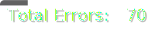

# 🧑‍💻 Sigma Labs Coursework

## 🛠️ Getting Setup

1. **Fork** this Repository to your Github Account
2. **Enable Workflows** on your cloned Repository. See the below image for how to do this.
3. **Clone** your Repository to your laptop
4. **Open** this folder in VSCode

## 🗂️ Files Explained

In this Repository you will find all of the materials for this week of the course.

As well as your coursework files you'll find some additional files

- `README.md`
  - This is the file you are currently reading
- `.gitignore`
  - This file is used to tell Git what files to ignore for any changes. This can be safely ignored.
- `.prettierrc`
  - This file is used to configure Prettier, an automated formatter that we suggest you install. This can be safely ignored.
- `.eslintrc.json` and `pylintrc`
  - Used to ensure that your code is following good style guides

You'll also find some folders:

- `.utils` folder
  - Some config files to help us to test your code
- `.github` folder
  - Configuration files used by Github
- `code_review` folder
  - Outputs of our automated code reviews. [See below](#code-review-folder) for more details.
- `.vscode` folder
  - This folder contains settings and config files for VSCode. They can be safely ignored.

Any other files or folder found here **are** relevant for your coursework.

## ✅ Code Review Folder

Every time you commit your code to Github, we will run a suite of tests to ensure that you code is of high quality.

It's worth noting - this **does not evaluate the quality of your solution**. Think of it as evaluating the 'grammar' and 'spelling' of your code rather than the actual quality of the work you've done.

Inside this folder you'll find two files

- `report.txt`
  - A plain text version of your code quality
- `report.json`
  - A computer-friendly version of your code quality, including your 'Code Quality Score'

Consistently keeping your score high will make your code easier to read and understand.
